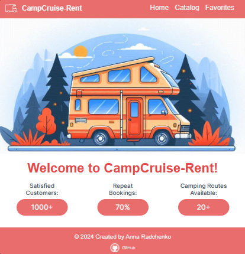

[UKR](#campcruise-rent) | [EN](#campcruise-rent-english) | [DEU](#campcruise-rent-german)

  <h1 align="center">CampCruise-Rent</h1>

 

This application is a web platform that offers camper rental services in Ukraine. Designed for those interested in motorhome or camper travel and want to find the perfect option for their journey. The main goal is to provide users with the opportunity to familiarize themselves with various campers available for rent and conveniently manage the rental process.
 

 

## Features

- **Home Page:** Users can find general information about the company's services, the benefits of camper travel, and other important aspects on this page.
- **Camper Catalog:** Here users can browse a list of available campers with different equipment. They can filter campers by various criteria such as location, equipment, and type.
- **Favorite Listings:** On this page, users can view a list of listings they have added to their favorites. This helps conveniently track desired camper options.
- **Camper Rental Listing Card:** Implemented according to the layout. Displays 4 listings on the first page of the catalog, and the rest are loaded by clicking the "Load more" button. Clicking the heart button adds the listing to the favorites list, changing the button color.
- **Results Fixation** Results of user actions are fixed when the page is refreshed. The modal window with detailed information about the camper opens when the "Show more" button is clicked and closes when the "x" button, background, or Esc key is pressed.

## Demo

## Tech Stack

- React
- Redux
- Emotion
- Axios
- Git
- Webpack/Babel
- React Router
- React PropTypes
- SVG

## Author

**Anna Radchenko**

___________________________________________________________________________________________________________________________________________________________________________________________________

  <h1 align="center">CampCruise-Rent</h1>

 

Diese Anwendung ist eine Webplattform, die Wohnmobilvermietungsdienste in der Ukraine anbietet. Sie richtet sich an diejenigen, die an Wohnmobil- oder Camperreisen interessiert sind und die perfekte Option für ihre Reise finden möchten. Das Hauptziel besteht darin, Benutzern die Möglichkeit zu geben, sich mit verschiedenen verfügbaren Wohnmobilen vertraut zu machen und den Vermietungsprozess bequem zu verwalten.
 

 

## Funktionen

- **Startseite:** Benutzer können allgemeine Informationen zu den Dienstleistungen des Unternehmens, den Vorteilen von Wohnmobilreisen und anderen wichtigen Aspekten auf dieser Seite finden.
- **Wohnmobilkatalog:** Hier können Benutzer eine Liste verfügbarer Wohnmobile mit unterschiedlicher Ausstattung durchsuchen. Sie können Wohnmobile nach verschiedenen Kriterien wie Standort, Ausstattung und Typ filtern.
- **Favorisierte Anzeigen:** Auf dieser Seite können Benutzer eine Liste der Anzeigen anzeigen, die sie zu ihren Favoriten hinzugefügt haben. Dies erleichtert das Verfolgen gewünschter Wohnmobiloptionen.
- **Wohnmobil-Vermietungsanzeigenkarte:** Gemäß dem Layout implementiert. Zeigt 4 Anzeigen auf der ersten Seite des Katalogs an, und der Rest wird durch Klicken auf die Schaltfläche "Mehr laden" geladen. Durch Klicken auf die Herzschaltfläche wird die Anzeige der Favoritenliste hinzugefügt und die Schaltflächenfarbe geändert.
- **Ergebnisfixierung** Die Ergebnisse der Benutzeraktionen werden beim Aktualisieren der Seite festgehalten. Das Modalfenster mit detaillierten Informationen zum Wohnmobil öffnet sich, wenn auf die Schaltfläche "Mehr anzeigen" geklickt wird, und schließt sich, wenn auf die Schaltfläche "x", den Hintergrund oder die Esc-Taste gedrückt wird.

## Demo

[(https://ammelystar.github.io/CampCruise-Rent/)]

## Technologie-Stack

- React
- Redux
- Emotion
- Axios
- Git
- Webpack/Babel
- React Router
- React PropTypes
- SVG

## Autor

**Anna Radchenko**

__________________________________________________________________________________________________________________________________________________________________________________________________

  <h1 align="center">CampCruise-Rent</h1>

 

Цей додаток - веб-платформа, що надає послуги з оренди кемперів в Україні. Призначений для тих, хто цікавиться подорожами на автодомах або кемперів і хоче знайти ідеальний варіант для своєї подорожі. Основна мета - забезпечити користувачам можливість ознайомитися з різноманітними кемперами, доступними для оренди, та зручно керувати процесом оренди.
 

 

## Особливості

- **Домашня сторінка:** На цій сторінці користувачі можуть дізнатися загальну інформацію про послуги компанії, переваги подорожей на кемперах та інші важливі аспекти.
- **Каталог кемперів:** Тут користувачі можуть переглядати список доступних кемперів з різною комплектацією. Вони можуть фільтрувати кемпери за різними критеріями, такими як місце розташування, обладнання та тип.
- **Улюблені оголошення:** На цій сторінці користувачі можуть переглядати список оголошень, які вони додали до списку улюблених. Це допомагає зручно відслідковувати потрібні варіанти кемперів.
- **Картка оголошення про оренду кемпера:** Реалізована відповідно до макету. Відображається 4 оголошення на першій сторінці каталогу, а решта - за кліком на кнопку "Завантажити ще". Клік на кнопці "серце" додає оголошення до списку улюблених, змінюючи колір кнопки.
- **Фіксація результатів** При оновленні сторінки фіксуються результати користувацьких дій. Модальне вікно з детальною інформацією про кемпер відкривається при кліку на кнопку "Детальніше" і закривається по кліку на "хрестик", тло або клавішу Esc.

## Демо

[(https://ammelystar.github.io/CampCruise-Rent/)]

## Технології

- React
- Redux
- Emotion
- Axios
- Git
- Webpack/Babel
- React Router
- React PropTypes
- SVG

## Автор

**Анна Радченко**

  

